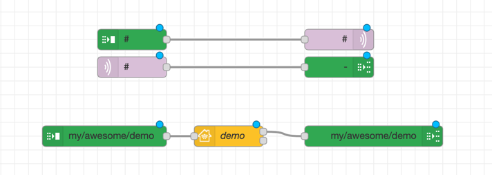
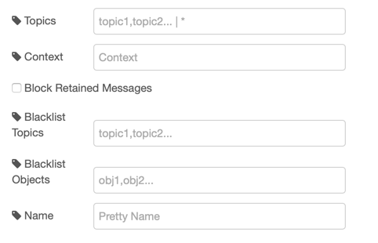
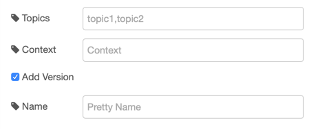

# node-red-contrib-flowcontrol
**Two powerful Nodes for MQTT-Style Message routing**

**Features:**
* Topic based Message routing
* MQTT style routing wildcards (+ and #)
* Message objs saved to global context
* Context based Loop blocking
* Topic and Obj Blacklists
* seamless MQTT and Homekit integration

**Node: Output**

**Node: INPUT**

